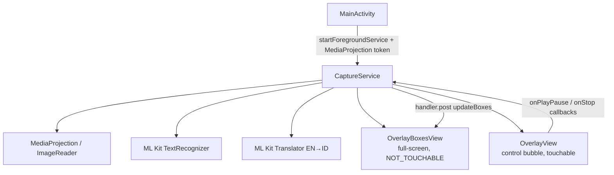

# Architecture

## Overview

Single-service architecture. `CaptureService` is the only foreground service, holding `mediaProjection` type. It manages screen capture, OCR, translation, and both overlay views directly.

## Key Design Decisions

- **Single service** — avoids Android 14+ restriction where `dataSync` + `mediaProjection` cannot coexist in separate services. All logic lives in `CaptureService`.
- **Dual overlay views** — `OverlayBoxesView` is `MATCH_PARENT + FLAG_NOT_TOUCHABLE` (draws translations at screen coordinates); `OverlayView` is `WRAP_CONTENT` (touchable control bubble).
- **Two-phase `startForeground`** — `onCreate` calls `startForeground` immediately (no type) to avoid 5-second timeout; `onStartCommand` upgrades to `mediaProjection` type after token is received.
- **On-device ML Kit** — no network calls after initial model download (~30MB).
- **Translation cache** — `ConcurrentHashMap<String, String>` avoids re-translating identical text lines.

## Android Version Constraints

| API | Behavior |
|---|---|
| Android 14+ (API 34) | `foregroundServiceType=dataSync` deprecated/killed; `mediaProjection` type required |
| Android 10+ (API 29) | `startForeground` must specify type |
| Android 8+ (API 26) | Must use `startForegroundService` |
| Android 6+ (API 23) | ML Kit translation minimum |
