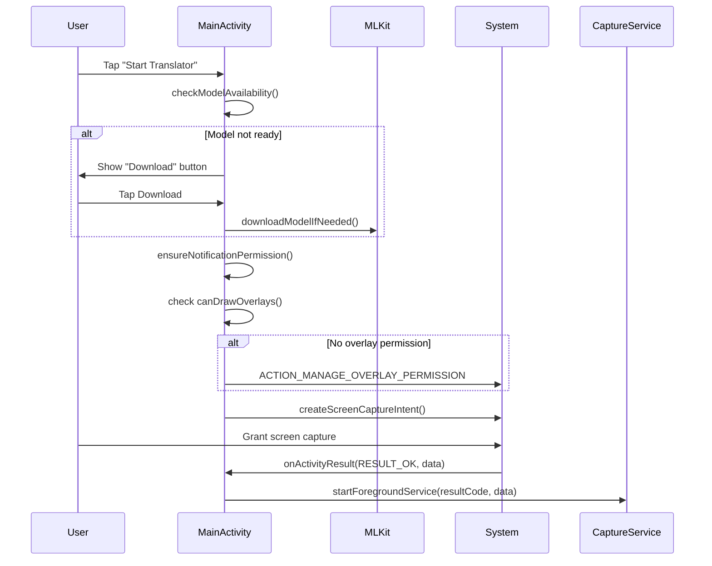
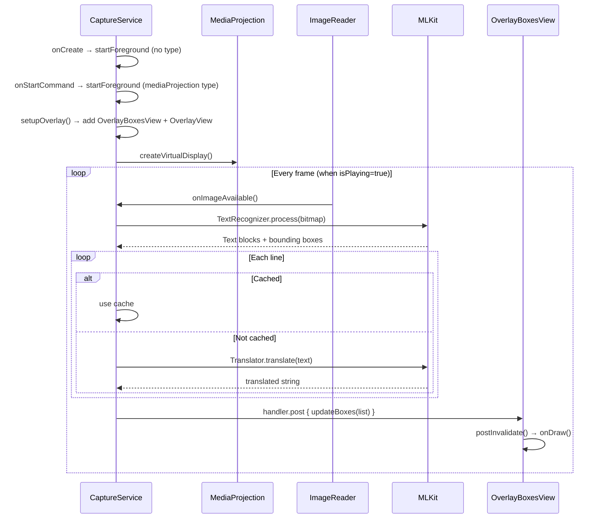

# Workflows

## App Start Flow

## Screen Capture & Translation Flow

## Play/Pause/Stop

- **Play** → `isPlaying = true`, `OverlayBoxesView.setPlaying(true)` → frames start processing
- **Pause** → `isPlaying = false`, `clearBoxes()` → frames skipped, overlay cleared
- **Stop** → `CaptureService.stopSelf()` → `onDestroy` → projection stopped, overlays removed
